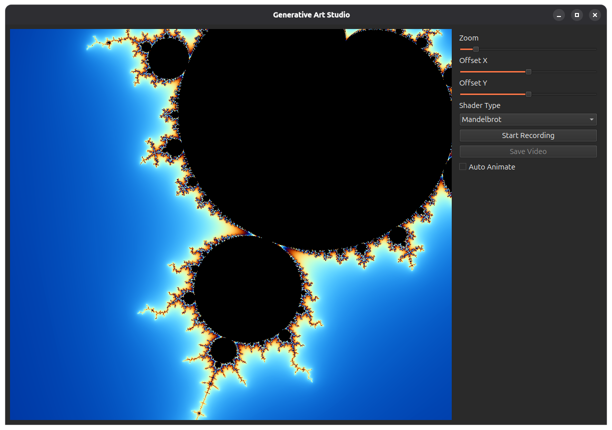

# Generative Art Studio

A real-time generative art exploration and recording tool built with Python, PySide6, and ModernGL.



## Features

- **Real-time Shader Rendering**: Explore a wide variety of generative art shaders including fractals, cellular automata, and fluid simulations.
- **Interactive Controls**: Adjust zoom and position (offset) in real-time.
- **Auto-Animation**: Enable dynamic movement and scaling of the art.
- **Video Recording**: Capture your explorations and save them as MP4 files.
- **Feedback Simulations**: Support for complex simulations like Game of Life, Reaction Diffusion, and Slime Molds using frame-buffer ping-ponging.

## Included Shaders

- **Fractals**: Mandelbrot, Julia, Burning Ship, Orbit Traps, IFS Morphing.
- **Simulations**: Game of Life, Smooth Life, Reaction Diffusion, Slime Mold, Flow Field, Curl Noise, Magnetic Fields.
- **Effects**: Voronoi, Kaleidoscope, GPU Fire, Smoke / Ink, Droplet Ripples, Cosmic, and more.

## Prerequisites

- Python 3.8 or higher.
- OpenGL 3.3 compatible graphics card and drivers.
- [uv](https://github.com/astral-sh/uv) (recommended for fast dependency management).

## Quick Start

The easiest way to get started is to use the provided `start.sh` script, which handles environment setup and dependency installation:

```bash
chmod +x start.sh
./start.sh
```

## Manual Setup

If you prefer to set up the environment manually:

1. **Create a virtual environment:**
   ```bash
   python -m venv .venv
   source .venv/bin/activate  # On Windows use: .venv\Scripts\activate
   ```

2. **Install dependencies:**
   ```bash
   pip install -r requirements.txt
   ```

3. **Run the application:**
   ```bash
   python main.py
   ```

## Usage

1. **Select a Shader**: Use the dropdown menu to switch between different generative art algorithms.
2. **Navigate**: Use the Zoom and Offset sliders to explore the visual space.
3. **Animate**: Check "Auto Animate" to let the parameters evolve over time.
4. **Record**:
   - Click **Start Recording** to begin capturing frames.
   - Click **Stop Recording** when finished.
   - Click **Save Video** to export the captured sequence to an MP4 file.

## Project Structure

- `main.py`: The entry point of the application, containing the PySide6 UI and GL widget.
- `renderer.py`: The ModernGL-based rendering engine that handles shader compilation and frame-buffer management.
- `shaders.py`: A collection of GLSL fragment shaders used by the application.
- `start.sh`: A utility script for automated setup and execution.
- `requirements.txt`: List of Python dependencies.

## Troubleshooting

If you encounter OpenGL initialization errors on Linux, ensure you have the necessary drivers installed. The `start.sh` script attempts to create symlinks for `libGL.so` and `libEGL.so` if they are missing from standard paths.
